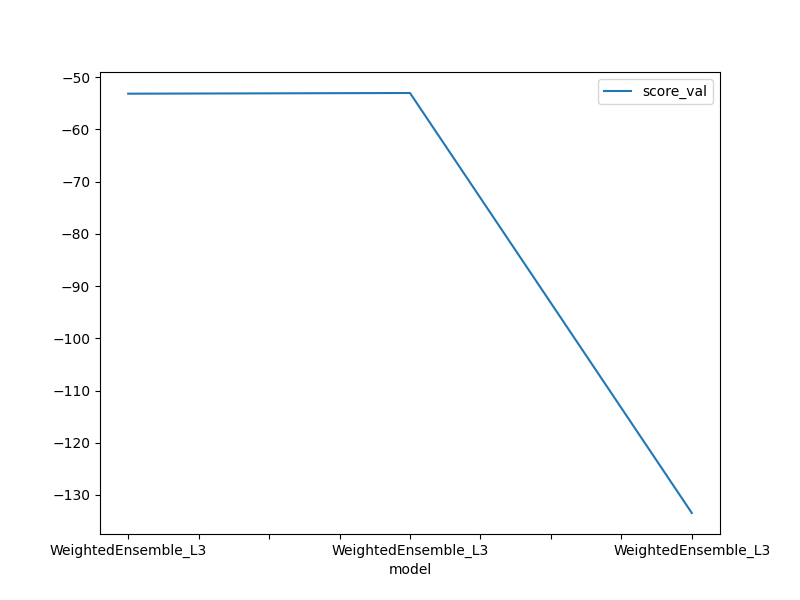

# Report: Predict Bike Sharing Demand with AutoGluon Solution
#### Paulo Mendes

## Initial Training
### What did you realize when you tried to submit your predictions? What changes were needed to the output of the predictor to submit your results?
The initial model (without optimization) provided predictions that were much inferior than those posted earlier in the Kaggle competition. Extant Kaggle scores
were several times lower than those provided by the initial model.

### What was the top ranked model that performed?
The model with optimized hyperparameters performed best.

## Exploratory data analysis and feature creation
### What did the exploratory analysis find and how did you add additional features?
I added weekday as a separate feature because I recokned that demand could vary as a function of the week (e.g. lower
on business days and higher on weekends). But exploraroty analysis showed that this wasn't true--demand was uniform across weekdays.
The resulting model performed marginally better the initial 'raw' model.

### How much better did your model preform after adding additional features and why do you think that is?
Performance improved (Kaggle score <1% lower) after weekday was added as a separate feature. This may have happened because biclcyel usage varied little as a function of the weekday. Therefore including weekdays afforded only a negligible imrpovement.

## Hyper parameter tuning
### How much better did your model preform after trying different hyper parameters?
Hyperparameter tuning yielded the best results, with a roughly 40% improvement in the model's Kaggle score.

A further attempt to introduce new hyperparameters to improve the performance of neural networks and greadient boosting methods, which were doing less well than weighted ensemble models, failed to improve either the Kaggle score or the overall Autogluon score.

### If you were given more time with this dataset, where do you think you would spend more time?
Since tweaking hyperparameters yielded the best results, trying out other values and combinations of hyperparameters seems to be the most promising approach. Another possibility is adding new features, particularly splitting datetime into day, month and year. Some models fared less well, so it might be profitable to discard them and focus efforts on the models that have yielded the best results so far.

### Create a table with the models you ran, the hyperparameters modified, and the Kaggle score.
|model|Time limit|Presets|Custom hpo|score|
|--|--|--|--|--|
|Initial|600|Best quality|No|1.807|
|Add weekday|600|Best quality|No|1.789|
|HPO tuning|600|Best quality|Yes|1.321|
|HPO tuning 2|600|Best quality|Yes|1.321|

### Create a line plot showing the top model score for the three (or more) training runs during the project.

TODO: Replace the image below with your own.

### Create a line plot showing the top kaggle score for the three (or more) prediction submissions during the project.

TODO: Replace the image below with your own.

## Summary
Training models is a complex undertaking because of the wide variety of available models and the complexity of each model.
To obtain optimal predictions, modelers must expend considerable effort in choosing and fine-tuning several models.
